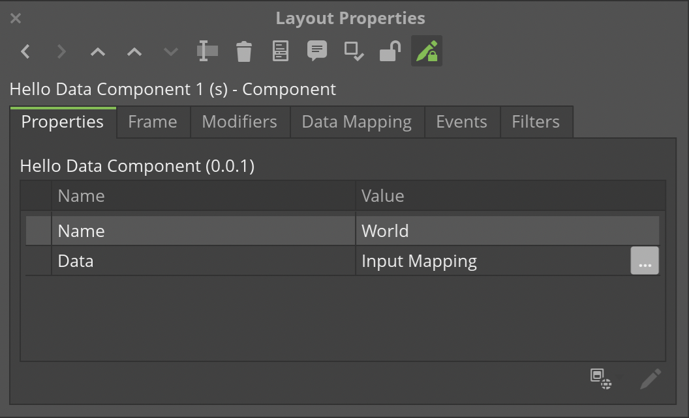

# Hello Data DC Component

> A sample component for use with Dynamic Communications in Quadient® Inspire.

## Usage

This project is intended to serve as a basic example of a custom Dynamic Communication (DC) component. Besides displaying the typical "Hello, World!" message, it also demonstrates how data can be passed to the component via an Input Mapping.

To use the component:

1. Install Quadient® Inspire Designer R12 or higher.

2. Clone the repo into the `${INSPIRE-ROOT}/DCComponents/Components` directory.

```sh
git clone https://github.com/robertwtucker/dc-hello-data.git
```

3. Open Designer and create a new Dynamic Communication.

4. Add the **Hello Data** component to the Dynamic Communication and modify the value of the **Name** property, if desired, in the *Layout Properties* dialog (shown below).



5. Add a Data Input module to the workflow and click the ellipsis (**•••**) button at the end of the **Data** property row to set the *Input Mapping* (see above).

6. Press `F6` to proof the DC and a "string-ified" display of the data that was passed.

## License

Distributed under the MIT License. See `LICENSE` for more information.

## Contact

Robert Tucker - [@robertwtucker](https://twitter.com/robertwtucker)

Project Link: [https://github.com/robertwtucker/dc-hello](https://github.com/robertwtucker/dc-hello)